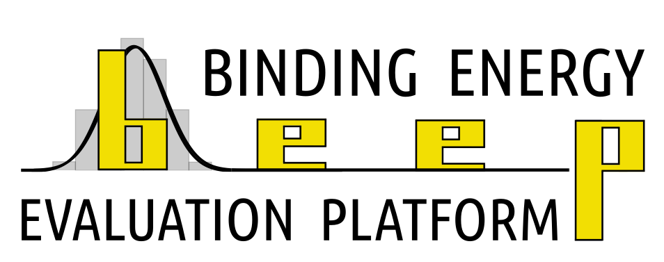

|

BEEP — Binding Energy Evaluation Platform
=========================================

BEEP is a binding energy evaluation platform and database for molecules on
interstellar ice-grain mantles.  Using quantum chemical methods, it produces
full binding energy (BE) distributions of molecules bound to an amorphous
solid water (ASW) surface model.

The platform automates the complete computational pipeline — from structure
sampling on a set of amorphized water clusters, through geometry optimization
at DFT level, to BSSE-corrected binding energy computation with ZPVE
corrections — and stores all results in a `QCFractal
<https://docs.qcarchive.molssi.org>`_ (v0.15) database for reproducible
querying.

For a detailed description of the methodology and results, see:

    G. M. Bovolenta, S. Vogt-Geisse, S. Bovino, and T. Grassi,
    *"Binding Energy Evaluation Platform: A database of quantum chemical
    binding energy distributions for the astrochemical community"*,
    `ApJ (2022) <https://doi.org/10.3847/1538-4357/ac8e11>`_.

Computational Workflows
-----------------------

The BEEP protocol consists of three main steps:

1. **Sampling** — Target molecules are randomly placed around a set of ASW
   clusters.  Binding site candidates (BSCs) are generated in batches,
   geometry-optimized, and filtered by RMSD to retain only unique sites.

2. **Geometry optimization** — BSCs are further refined at a higher level of
   theory selected through a geometry benchmark.

3. **Binding energy calculation** — BSSE-corrected BEs are computed via the
   counterpoise method, ZPVE corrections are derived from a Hessian-based
   linear model, and the final distribution is assembled and fitted with a
   Gaussian function.

Architecture
------------

The codebase is organized into four layers:

- **Core** (``beep.core``) — Pure computational logic: molecular sampling, RMSD
  filtering, shell generation, ZPVE corrections, CBS extrapolation, and
  pre-exponential factor calculations.  No external server dependencies.
- **Models** (``beep.models``) — Pydantic configuration models that define and
  validate the input parameters for each workflow.
- **Adapters** (``beep.adapters``) — Thin wrappers around external services
  (QCFractal server I/O), isolating all network and database access.
- **Workflows** (``beep.workflows``) — Orchestration layer that ties core logic
  and adapters together into the six user-facing workflows.

A single CLI entry point (``beep --config input.json``) dispatches to the
appropriate workflow based on the configuration file.

.. toctree::
   :maxdepth: 2
   :caption: Contents:

   getting_started
   api

Indices and tables
==================

* :ref:`genindex`
* :ref:`modindex`
* :ref:`search`
